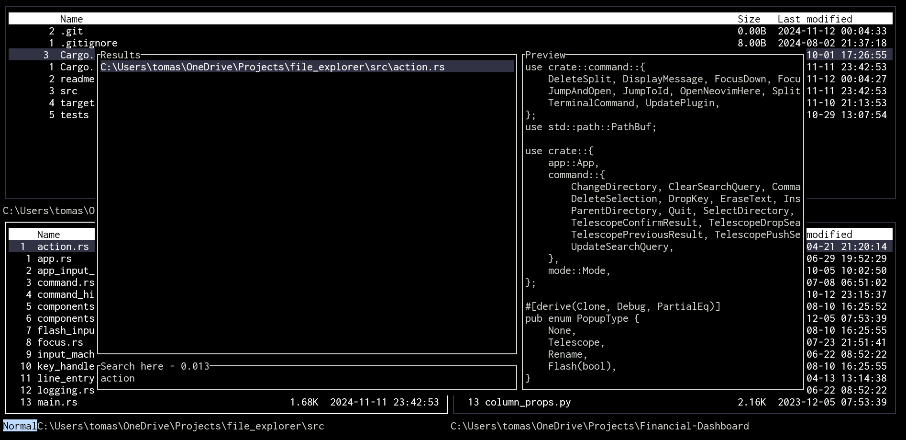

A [telescope](https://github.com/nvim-telescope/telescope.nvim)-style plugin for [Blaze Explorer](https://github.com/tomblazejewski/blaze-explorer)

# App Mappings

## Plugin level

| Default Mappings | Action                                                                                          |
| ---------------- | ----------------------------------------------------------------------------------------------- |
| `<space>sg`      | Search files by name (similar to [telescope](https://github.com/nvim-telescope/telescope.nvim)) |

## PopUp level

| Mappings  | Action             |
| --------- | ------------------ |
| `<C-n>`   | Next item          |
| `<C-p>`   | Previous item      |
| `<Enter>` | Open selected item |
| `<Esc>`   | Close popup        |

# Functionalities

- [x] Search files by name
- [ ] Search files by content
- [ ] Search app keymaps
- [ ] Search git commits
